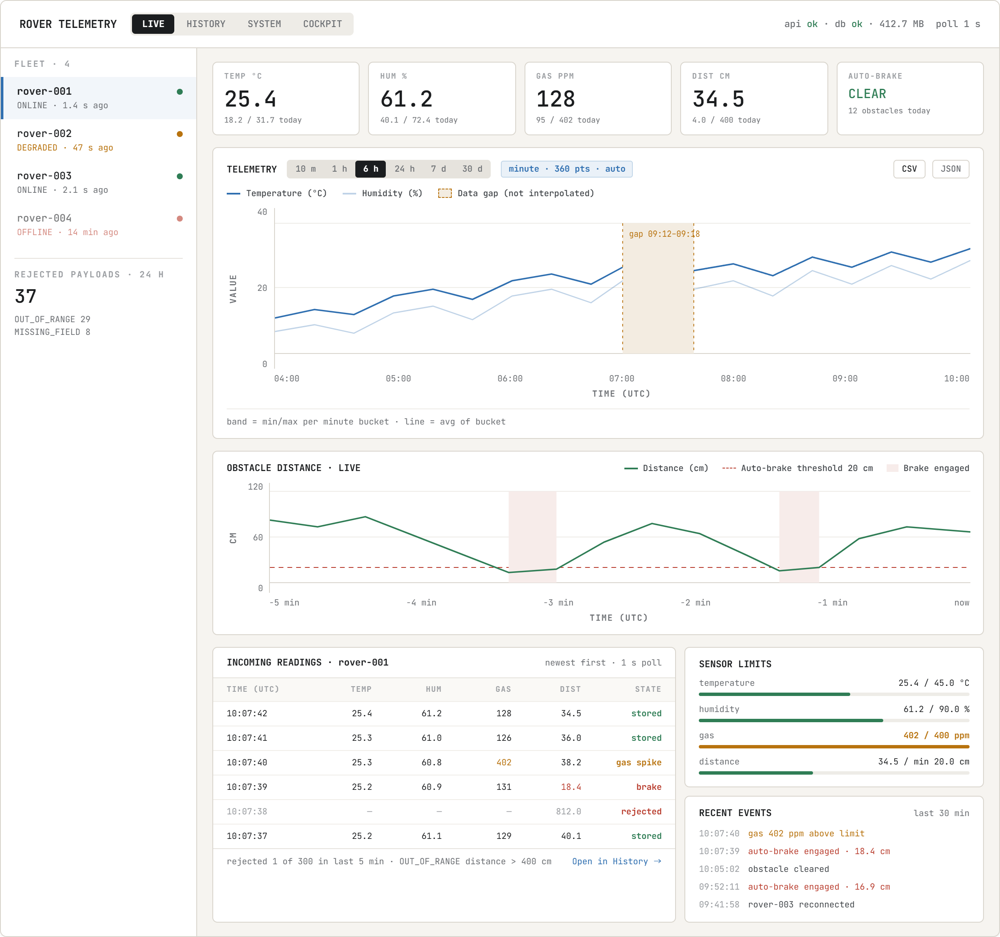
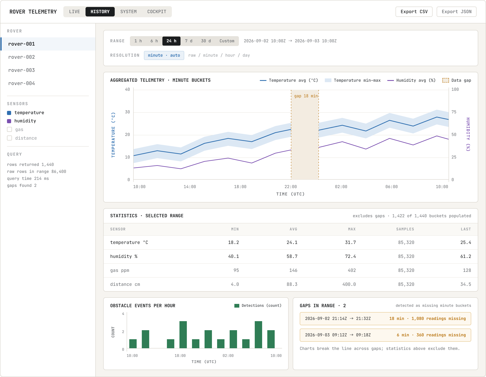
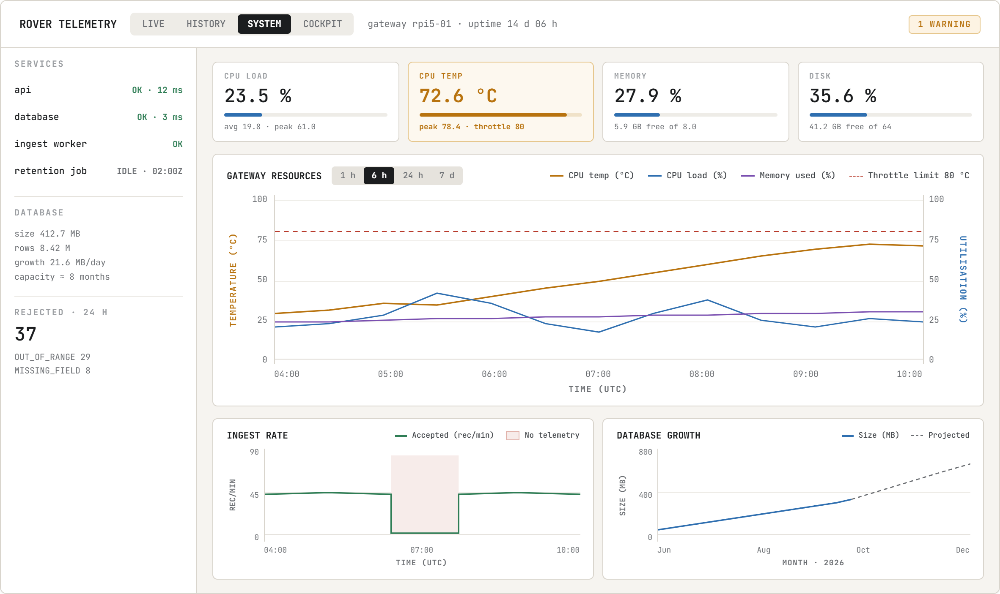
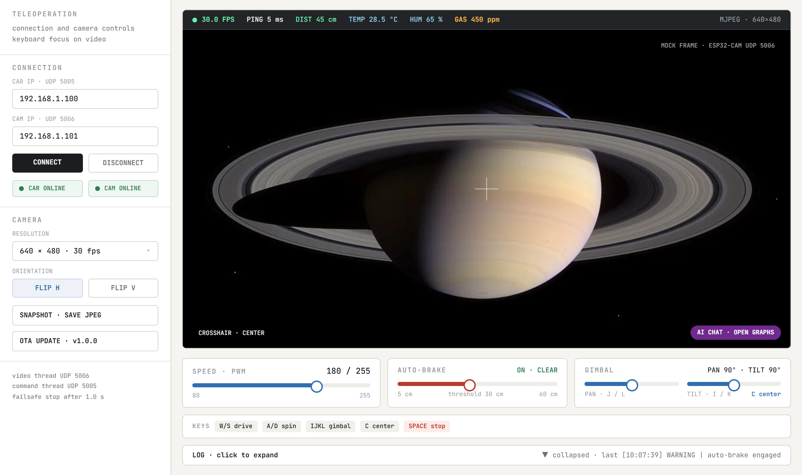

# Central Telemetry & Data Management Backend
## Design Proposal — Database Schema, API Contract, and Implementation Plan

**Document version:** v1.1
**Date:** 2026-09-04 (originally 2026-09-03)
**Author:** Shodai Tokura (Backend & Data Engineer Intern)

**Supersedes:** Earth Rover Cloud System Technical Requirements v0.1 / v0.3 / v0.4 / v0.5. Those documents assumed a cloud-hosted FastAPI service with mission-scoped storage and an undetermined sensor list. This document replaces them in full, per the PRD.

---

## 1. Purpose

This document is the Phase 1 deliverable requested in PRD §5 and §6. It contains:

1. Entity-Relationship Diagram and database schema design (§5)
2. RESTful API proposal and endpoint contract (§6)
3. Data flow and sequence diagrams (§4)
4. Implementation plan and test strategy (§9, §10)

Points that cannot be finalized without mentor input are marked `[To confirm]` where they arise.

### 1.1 Notation

| Tag | Meaning |
|---|---|
| `[PRD]` | Explicitly required by the PRD. Mandatory. |
| `[Proposed]` | Design decision proposed by the intern. Requires approval. |
| `[To confirm]` | Decision that cannot be finalized without mentor input. |
| `[Deferred]` | Intentionally excluded from the first implementation, with a stated reason. |

---

## 2. Scope

### 2.1 In scope

- Telemetry ingestion endpoint with input validation and range sanitization
- Raw timeseries persistence on the Central Gateway (Raspberry Pi 5)
- Aggregated hourly and daily summaries
- Query API: latest snapshot, last N records, time-range queries, daily statistics
- CSV and JSON export
- Gateway health and service health endpoints
- Python-based rover simulator and load-test suite

### 2.2 Out of scope

- Rover firmware implementation
- Desktop client implementation (Haru)
- Rover teleoperation and command dispatch — the PRD describes a telemetry and data management backend only, with no control-path requirement. The reference dashboard includes a teleoperation screen (§11.4), but it talks to the rover directly over UDP and does not use this API. This exclusion is to be confirmed.
- Web dashboard UI — the PRD specifies API consumers ("high-refresh client dashboards") but does not assign dashboard implementation to this backend. This boundary is to be confirmed; a reference layout is included in §11 either way.
- Video capture and storage

---

## 3. System Context

The Central Telemetry Backend runs on the Central Gateway (Raspberry Pi 5). It is the persistent memory of the rover fleet.

```
   +-------------------+     +-------------------+
   |  Space Rover #1   | ... |  Space Rover #N   |
   |     (ESP32)       |     |     (ESP32)       |
   +---------+---------+     +---------+---------+
             |                         |
             |   HTTP POST telemetry every 1-5 s
             +------------+------------+
                          |
             +------------v--------------------------+
             |   Central Gateway (Raspberry Pi 5)    |
             |                                       |
             |   +-------------------------------+   |
             |   |  PHP REST API (Apache/nginx)  |   |
             |   +---------------+---------------+   |
             |                   |                   |
             |   +---------------v---------------+   |
             |   |          MariaDB              |   |
             |   |  raw readings + summaries     |   |
             |   +-------------------------------+   |
             |                   ^                   |
             |   +---------------+---------------+   |
             |   |  Aggregation job (cron)       |   |
             |   +-------------------------------+   |
             +---------------------+-----------------+
                                   |
              +--------------------+--------------------+
              |                    |                    |
     +--------v------+   +---------v-------+   +--------v--------+
     | Rover Pilot   |   |  Ops / Science  |   |  System Admin   |
     | Desktop (Haru)|   |     Analyst     |   |                 |
     +---------------+   +-----------------+   +-----------------+
```

### 3.1 Design principles

1. **The ingest path stays cheap.** A rover posting every 1–5 s must never wait on aggregation, reporting, or export work. Summaries are computed by a separate scheduled job, not inline with ingestion.
2. **The latest-snapshot query is a single index seek.** The 30 ms acceptance criterion is met by schema design, not by caching.
3. **Store raw data once, in one shape.** Aggregates are derived and rebuildable from raw data; they are never the source of truth.
4. **Reject bad data at the boundary.** Validation happens before the write, so the database never contains a value outside its declared physical range.
5. **The Pi 5 is a constrained host.** Storage, IO, and CPU budgets are treated as real limits (§8.3), not as afterthoughts.

---

## 4. Data Flow and Sequence

### 4.1 Ingestion sequence

Normal path:

```
Rover                  PHP API              Validator                MariaDB
  |                       |                     |                       |
  |-- POST /telemetry ---->                     |                       |
  |                       |-- stamp recorded_at = now() UTC              |
  |                       |-- validate fields -->                       |
  |                       <-------------- valid |                       |
  |                       |                     |                       |
  |                       |-- get or create rover by device_uid -------->
  |                       <---------------------------------- device_id |
  |                       |-- UPDATE rovers SET last_seen_at ----------->
  |                       |-- INSERT INTO telemetry_readings ----------->
  |                       <------------------------------ affected rows |
  <---------- 201 Created |                     |                       |
```

The rover lookup is a separate round trip because an unrecognized `device_uid` may need to be registered before the reading can reference it. Registration is automatic (§5.3). `last_seen_at` (§5.3) is updated in the same transaction as the reading insert.

`[Duke, 2026-09-04]` `recorded_at` is stamped by the gateway on receipt, not sent by the rover, because the ESP32 build has no hardware RTC and would otherwise report a wrong or 1970-epoch time after every reboot. One consequence: a retried POST after a network drop lands at a different receipt time than the original attempt, so it no longer collides with it on the primary key. Rather than adding a second key to detect and collapse such retries, a retry is accepted as a second, distinct row — see §5.4's note on this and §6.2's response. This is why the insert is a plain `INSERT`, not `INSERT ... ON DUPLICATE KEY UPDATE` as in the original proposal.

Validation failure path:

```
Rover                  PHP API              Validator                MariaDB
  |                       |                     |                       |
  |-- POST /telemetry ---->                     |                       |
  |                       |-- validate fields -->                       |
  |                       <------- OUT_OF_RANGE |                       |
  |                       |-- INSERT INTO validation_errors ------------>
  <---- 422 Unprocessable |                     |                       |
```

The rejected payload is recorded and the service continues serving, as required by PRD §3.1. Nothing is written to `telemetry_readings`.

### 4.2 Query sequence (latest snapshot)

```
Desktop Client                         PHP API                           MariaDB
       |                                  |                                 |
       |-- GET /rovers/rover-001/latest -->                                 |
       |                                  |-- resolve uid, SELECT latest --->
       |                                  <------------- 1 row (index seek) |
       <------------------------ 200 JSON |                                 |
```

The path `device_uid` is resolved to the internal `device_id` first; the reading query is then `SELECT ... WHERE device_id = ? ORDER BY recorded_at DESC LIMIT 1` — a single backward seek on the clustered index. Target: under 30 ms end to end (PRD §4).

The last-N, time-range, and export endpoints follow the same three-hop path; only the SQL and the response serialization differ.

### 4.3 Scheduled jobs (aggregation and retention)

```
  cron                  aggregate job                              MariaDB
    |                         |                                       |
    |-- trigger (1 min) ------>                                       |
    |                         |-- GROUP BY over last 2 buckets ------->
    |                         <---------------------- aggregated rows |
    |                         |-- INSERT ... ON DUPLICATE KEY UPDATE ->
```

The job runs every minute, recomputing the last few `minute` buckets; on the hour it also recomputes `hour` buckets, and after midnight local time it recomputes the previous day. The same job also writes one `gateway_metrics` sample (§5.7). One cron entry covers all three granularities and the host sampler. The last two buckets are recomputed rather than only the most recent one, so telemetry that arrives late — after a rover reconnects and flushes a queue — is still reflected in the summary.

`INSERT ... ON DUPLICATE KEY UPDATE` is used here rather than `REPLACE INTO`, since a bucket for the same `(device_id, granularity, bucket_start)` is recomputed in place every run. `REPLACE` deletes and re-inserts the row, doubling the write and triggering foreign-key delete behaviour for no benefit. (This is unlike the ingest path itself, §4.1, which now uses a plain `INSERT` since `recorded_at` no longer provides a natural dedup key — see §5.4.)

```
  cron                  retention job                              MariaDB
    |                         |                                       |
    |-- nightly trigger ------>                                       |
    |                         |-- DELETE ... LIMIT (batched) --------->
    |                         <------------------------- rows removed |
```

Deletion runs in bounded batches so the ingest path is never blocked by a long-held lock. Retention windows are still to be confirmed.
---

## 5. Database Design

### 5.1 Entity-Relationship Diagram

```
+---------------------------+
|          rovers           |
+---------------------------+
| PK id            BIGINT   |
| UQ device_uid    VARCHAR  |
|    name          VARCHAR  |
|    firmware_ver  VARCHAR  |
|    enabled_sensors SET    |
|    last_seen_at  DATETIME3|
|    created_at    DATETIME |
+-------------+-------------+
              |
              | 1
              |
      +-------+--------+-------------------+
      |                                    |
      | N                                  | N
+-----v---------------------+   +----------v------------------+
|    telemetry_readings     |   |    telemetry_summaries      |
+---------------------------+   +-----------------------------+
| PK device_id     BIGINT   |   | PK device_id      BIGINT    |
| PK recorded_at   DATETIME3|   | PK granularity    ENUM      |
|    temperature_c FLOAT    |   | PK bucket_start   DATETIME  |
|    humidity_pct  FLOAT    |   |    sample_count   INT       |
|    gas_ppm       FLOAT    |   |    temp_min/avg/max  FLOAT  |
|    distance_cm   FLOAT    |   |    hum_min/avg/max   FLOAT  |
|    auto_brake    TINYINT  |   |    gas_min/avg/max   FLOAT  |
+---------------------------+   |    dist_min/avg/max  FLOAT  |
                                |    obstacle_events   INT    |
                                |    computed_at       DATETIME|
                                +-----------------------------+

+---------------------------+
|   validation_errors       |   (no FK — the device may be unknown)
+---------------------------+
| PK id            BIGINT   |
|    device_uid    VARCHAR  |
|    received_at   DATETIME |
|    error_code    VARCHAR  |
|    detail        VARCHAR  |
|    raw_payload   TEXT     |
+---------------------------+

+---------------------------+
|     gateway_metrics       |   (host-level, no rover FK)
+---------------------------+
| PK sampled_at    DATETIME |
|    cpu_load_percent FLOAT |
|    cpu_temperature_c FLOAT|
|    memory_used_pct  FLOAT |
|    disk_used_pct    FLOAT |
|    ingest_rate_min  INT   |
|    database_size_mb FLOAT |
+---------------------------+

+---------------------------+
|       media_files         |   (rovers 1--N media_files)
+---------------------------+
| PK id             BIGINT  |
| FK device_id      BIGINT  |
|    media_type     ENUM    |
|    file_path      VARCHAR |
|    captured_at    DATETIME3|
|    file_size_bytes INT    |
|    mime_type      VARCHAR |
|    original_filename VARCHAR|
|    file_hash      CHAR(64)|
+---------------------------+

+---------------------------+
|      sensor_limits        |   (config, no rover FK)
+---------------------------+
| PK field         VARCHAR  |
|    min_value     FLOAT    |
|    max_value     FLOAT    |
|    updated_at    DATETIME |
+---------------------------+
```

### 5.2 Storage conventions

InnoDB engine, `utf8mb4` character set, all timestamps stored in UTC. `DATETIME(3)` provides millisecond precision as required by PRD §3.2 ("high timestamp precision").

### 5.3 rovers

| Column | Type | Constraint | Purpose |
|---|---|---|---|
| id | BIGINT UNSIGNED | PK, AUTO_INCREMENT | Internal rover ID |
| device_uid | VARCHAR(64) | NOT NULL, UNIQUE | The PRD's "Device Identifier", as sent by the rover |
| name | VARCHAR(100) | NULL | Human-readable display name |
| firmware_version | VARCHAR(30) | NULL | Reported firmware version |
| enabled_sensors | SET('temperature_c','humidity_pct','gas_ppm','distance_cm') | NOT NULL, DEFAULT all four | Which sensors this specific rover actually carries |
| last_seen_at | DATETIME(3) | NULL | Timestamp of the most recent successful ingest for this rover |
| created_at | DATETIME | DEFAULT CURRENT_TIMESTAMP | First registration time |

`[Duke, 2026-09-04]` `last_seen_at` is updated in the same transaction as every successful `INSERT ... ON DUPLICATE KEY UPDATE` into `telemetry_readings` (§4.1). It exists because `GET /rovers` (§6.3) is polled every second by the dashboard and previously had to derive each rover's status with a correlated subquery against `telemetry_readings` per request; reading one column off `rovers` is cheaper at that polling rate. `telemetry_readings` remains the source of truth for the reading itself — `last_seen_at` is a denormalized copy kept only for this lookup.

`[Proposed]` An unknown `device_uid` arriving in valid telemetry is registered automatically. This supports the PRD's fleet model ("one or multiple rovers", §3.5) without a manual provisioning step, which matters for the load-test tool that simulates multiple devices. If Duke prefers a closed fleet where unknown devices are rejected, this becomes a one-line change.

`[Proposed]` `enabled_sensors` exists because not every rover build has every sensor installed yet. It tells the validator which fields are actually required for this device, per §5.4 and §6.2, instead of every rover being held to the full five-field payload regardless of what hardware it carries. A rover auto-registered on first contact (above) is assumed to carry all four sensors until an administrator narrows it, since the alternative — guessing which sensors are absent from a single payload — is not reliable.

### 5.4 telemetry_readings

The core table. **One row per telemetry record**, with one column per sensor field.

| Column | Type | Constraint | Unit / Range |
|---|---|---|---|
| device_id | BIGINT UNSIGNED | PK part 1, FK → rovers.id | — |
| recorded_at | DATETIME(3) | PK part 2 | UTC, millisecond precision |
| temperature_c | FLOAT | NULL | °C |
| humidity_pct | FLOAT | NULL | % |
| gas_ppm | FLOAT | NULL | ppm |
| distance_cm | FLOAT | NULL | cm |
| auto_brake | TINYINT(1) | NOT NULL | 0 = inactive, 1 = engaged |

**Sensor columns are nullable, keyed to `rovers.enabled_sensors` (§5.3).** Not every rover build has every sensor installed. A field is required in the payload, and rejected with `MISSING_FIELD` if absent, only when it is listed in that rover's `enabled_sensors`; for a sensor the rover does not carry, the field is optional and stored as `NULL` rather than rejected or defaulted to zero. `NULL` means "not fitted on this rover," which is a different fact from `0`, a real reading, or an out-of-range rejection — collapsing them would make a missing gas sensor look identical to a gas reading of zero. `auto_brake` stays `NOT NULL` because it drives a safety behavior rather than reporting a sensor class that varies per build.

**Composite primary key `(device_id, recorded_at)`.** This single choice satisfies four separate requirements:

1. **Latest snapshot in under 30 ms (PRD §4).** `WHERE device_id = ? ORDER BY recorded_at DESC LIMIT 1` is a backward seek to the end of one clustered-index range. Cost is independent of table size.
2. **Indexed by device and timestamp (PRD §3.2).** The requirement is satisfied by the clustered index itself; no secondary index is needed, so no secondary index has to be maintained on every insert.
3. **Range and last-N queries (PRD §3.3).** Both are contiguous scans within the same clustered range.
4. **No retry deduplication, by decision rather than by design gap.** `recorded_at` is stamped by the gateway on receipt (§4.1), not set by the rover, since the ESP32 build has no RTC. This means the composite key is no longer a natural dedup key: a retried POST after a dropped connection lands at a new receipt time and is stored as a second, distinct row rather than colliding with the original. `[Duke, 2026-09-04]` This is an accepted tradeoff, not an oversight — building real idempotency back in would mean adding a client-generated sequence number and a second unique key, which is more machinery than the retry case currently justifies. If retried-record duplication turns out to matter in practice, that is the fix to make later.

**No surrogate `id` column.** The composite key is still the primary access path — `WHERE device_id = ? ORDER BY recorded_at DESC LIMIT 1` for the latest-snapshot query (point 1 above) is unaffected by dropping the dedup guarantee. An auto-increment ID would add 8 bytes per row and change nothing about how the table is read.

**Why `FLOAT` and not `DOUBLE`.** The physical sensors resolve to roughly 0.1 °C, 0.1 %, 1 ppm, and 0.3 cm. `FLOAT` carries about 7 significant digits, which is one to two orders of magnitude more precision than the hardware produces. Using `DOUBLE` for all four fields would add 16 bytes per row — roughly a third of the row — to store noise.

**Why a wide table rather than a key-value row per sensor.** The PRD fixes the sensor set at five fields (§3.1), so the flexibility of a narrow table buys nothing here, while costing five times the row count, a repeated timestamp per sensor, and an awkward representation for `auto_brake`, which is a boolean rather than a measurement. The wide shape also makes the daily statistics query (§6.6) a single pass instead of five correlated subqueries. If a sixth sensor is added later, the change is one `ALTER TABLE ... ADD COLUMN`, which on this data volume completes in seconds.

### 5.5 telemetry_summaries

Precomputed aggregates, so long-range reporting never scans the raw table (PRD §3.2).

| Column | Type | Constraint | Purpose |
|---|---|---|---|
| device_id | BIGINT UNSIGNED | PK part 1, FK → rovers.id | Target rover |
| granularity | ENUM('minute','hour','day') | PK part 2 | Bucket size |
| bucket_start | DATETIME | PK part 3 | Bucket start, UTC |
| sample_count | INT UNSIGNED | NOT NULL | Rows aggregated into this bucket |
| temp_min / temp_avg / temp_max | FLOAT | NULL | °C |
| hum_min / hum_avg / hum_max | FLOAT | NULL | % |
| gas_min / gas_avg / gas_max | FLOAT | NULL | ppm |
| dist_min / dist_avg / dist_max | FLOAT | NULL | cm |
| obstacle_events | INT UNSIGNED | NOT NULL | Obstacle encounters in this bucket |
| computed_at | DATETIME | NOT NULL | When this row was last recomputed |

A `minute` granularity exists so that mid-range charts (6 hours, 24 hours) have a usable point count. Without it there is a resolution gap: 6 hours of raw data is 21,600 points at the fastest transmission interval — too many to plot — while 6 hours of hourly summaries is 6 points, which is not a chart. Minute buckets give 360 and 1,440 points for those two ranges. See §6.5.

`sample_count` is stored so a consumer can tell a quiet hour with three samples from a full hour with thousands, and so partial buckets are visible rather than silently misleading.

**The min/avg/max columns are nullable, matching the `NULL` sensor columns in `telemetry_readings` (§5.4).** `AVG()`, `MIN()`, and `MAX()` already ignore `NULL` inputs in SQL, so a bucket built entirely from readings where `gas_ppm` is `NULL` — a rover with no gas sensor — naturally aggregates to `gas_min/avg/max = NULL`, rather than to a misleading zero. `sample_count` still counts rows, not non-null values per column, since it exists to describe the bucket as a whole (§5.5 above), not each sensor separately.

`obstacle_events` counts **rising edges** of `auto_brake` (transitions from 0 to 1), not the number of rows where `auto_brake = 1`. A single obstacle encounter that holds the brake for 20 seconds is one event, not twenty rows' worth. This is a proposed interpretation.

### 5.6 validation_errors

PRD §3.1 requires that malformed payloads are logged without crashing the service. Storing them in a table rather than a text file makes the load-test suite able to assert on rejection behaviour directly.

| Column | Type | Constraint | Purpose |
|---|---|---|---|
| id | BIGINT UNSIGNED | PK, AUTO_INCREMENT | Record ID |
| device_uid | VARCHAR(64) | NULL | As claimed by the payload; may be absent or unknown |
| received_at | DATETIME(3) | NOT NULL | Gateway receipt time |
| error_code | VARCHAR(40) | NOT NULL | e.g. `OUT_OF_RANGE`, `MISSING_FIELD` |
| detail | VARCHAR(255) | NOT NULL | Which field failed and why |
| raw_payload | TEXT | NULL | Original body, truncated to 4 KB |

No foreign key to `rovers`: an invalid payload may carry an unknown or missing device identifier, which is exactly the case worth recording.

`[Proposed]` This table is capped by a retention job (§8.4) so a misbehaving device cannot fill the SD card with rejected payloads.

### 5.7 gateway_metrics

Host metrics sampled once per minute, so gateway health can be charted over time rather than only observed at the instant the page is opened.

| Column | Type | Constraint | Purpose |
|---|---|---|---|
| sampled_at | DATETIME | PK | Sample time, UTC |
| cpu_load_percent | FLOAT | NOT NULL | CPU load |
| cpu_temperature_c | FLOAT | NOT NULL | SoC temperature |
| memory_used_percent | FLOAT | NOT NULL | RAM in use |
| disk_used_percent | FLOAT | NOT NULL | Root filesystem usage |
| ingest_rate_per_min | INT UNSIGNED | NOT NULL | Records stored in the preceding minute |
| database_size_mb | FLOAT | NOT NULL | Total database size |

There is no device column: the gateway is a single host, so `sampled_at` alone is the key.

`[Proposed]` The sample is taken by the same cron job that computes telemetry summaries (§4.3), which already runs every minute. This adds no new scheduled task and keeps the metric cadence aligned with the aggregation cadence.

At one row per minute the table grows by 1,440 rows — roughly 70 KB — per day, so a full year is about 26 MB. This is small enough that retention is a matter of tidiness rather than capacity.

`ingest_rate_per_min` is stored rather than recomputed at read time. Counting rows in `telemetry_readings` for an arbitrary past minute is a range scan per point; charting six hours of it would mean 360 such scans. Storing the count once at sample time reduces that to a single sequential read.

### 5.8 media_files

`[Proposed]` Stores the filesystem or object-storage path to a photo or video captured by a rover, not the binary itself. This keeps large media out of MariaDB, consistent with §2.2's exclusion of video capture and storage from this backend's core scope; the table exists so a path can be recorded if and when a capture mechanism is added elsewhere.

| Column | Type | Constraint | Purpose |
|---|---|---|---|
| id | BIGINT UNSIGNED | PK, AUTO_INCREMENT | Record ID |
| device_id | BIGINT UNSIGNED | NOT NULL, FK → rovers.id | Rover that captured the media |
| media_type | ENUM('photo','video') | NOT NULL | Distinguishes still images from video clips |
| file_path | VARCHAR(255) | NOT NULL | Path on the gateway filesystem or object store |
| captured_at | DATETIME(3) | NOT NULL | UTC, millisecond precision, matching `telemetry_readings` |
| file_size_bytes | INT UNSIGNED | NOT NULL, DEFAULT 0 | File size in bytes |
| mime_type | VARCHAR(50) | NOT NULL, DEFAULT `image/jpeg` | e.g. `image/jpeg`, `video/mp4` |
| original_filename | VARCHAR(200) | NULL | Filename as uploaded, before the storage-path convention (§5.8.1) is applied |
| file_hash | CHAR(64) | NULL | SHA-256 of the file contents, for integrity verification |

`[Duke, 2026-09-04]` These four columns close a gap flagged in Phase 1 review: without them there was no way to detect a truncated upload, tell files apart by original name, or know a video's size before streaming it. `file_size_bytes` and `mime_type` default rather than reject when absent, because the upload endpoint (§6.13) can derive both from the uploaded file itself; `original_filename` and `file_hash` stay nullable since older or externally-placed files may not have either.

A secondary index on `(device_id, captured_at)` supports "media for rover X in time range Y" lookups, the same access pattern as telemetry.

### 5.8.1 Media storage path convention

`[Duke, 2026-09-04]` Files are written under a fixed directory structure, and `media_files.file_path` stores the resulting path:

```
/var/rover-media/{device_uid}/{YYYY}/{MM}/{DD}/{timestamp}_{filename}
```

Example: `/var/rover-media/esp32_car/2026/09/04/10-00-00-123_snapshot.jpg`

Partitioning by device and date keeps any one directory from accumulating an unbounded number of files, and makes it possible to locate a rover's media for a given day without a database lookup, e.g. during manual inspection or backup.

### 5.9 Validation ranges

PRD §3.1 requires rejection of physically impossible readings. `[Proposed]` Rather than hard-coding these bounds, they are stored in a `sensor_limits` table and read by the validator at request time (with an in-process cache refreshed on write, so a limit change does not add a query to the ingest path). This is what makes the ranges editable from the System view (§11.3) without a deployment: an administrator adjusts a value in the UI, the UI calls the update endpoint in §6.11, and the next ingest request is validated against the new bound.

Seed values, based on the sensor classes typical for this build:

| Field | Accepted range | Rationale |
|---|---|---|
| temperature_c | −40 … 85 | DHT22 / BME280 rated operating range |
| humidity_pct | 0 … 100 | Physical bound |
| gas_ppm | 0 … 10000 | MQ-series index range |
| distance_cm | 2 … 400 | HC-SR04 rated measurement range |
| auto_brake | 0 or 1 | Boolean |
| recorded_at | not more than 60 s in the future, not more than 7 days in the past | Guards against unsynchronized rover clocks |

These seed values must be confirmed against the actual hardware before implementation. The clock-skew bound in particular is a proposal with no PRD basis; it exists because a rover with an unset RTC will otherwise write readings dated 1970 into the middle of the timeseries. `auto_brake` and the `recorded_at` clock-skew rule are boolean/structural checks rather than a stored min/max, so they stay in validator code rather than in `sensor_limits`; only the four numeric sensor fields are editable through the table.

| Column | Type | Constraint | Purpose |
|---|---|---|---|
| field | VARCHAR(30) | PK | Sensor column name, e.g. `temperature_c` |
| min_value | FLOAT | NOT NULL | Lower bound, inclusive |
| max_value | FLOAT | NOT NULL | Upper bound, inclusive |
| updated_at | DATETIME | NOT NULL, DEFAULT CURRENT_TIMESTAMP ON UPDATE CURRENT_TIMESTAMP | Last change, shown in the admin UI |

A changed limit is not retroactive: readings already stored keep whatever was valid when they were ingested, and only new writes are checked against the updated bound.

### 5.10 Reference DDL

```sql
CREATE DATABASE IF NOT EXISTS rover_telemetry
  DEFAULT CHARACTER SET utf8mb4 COLLATE utf8mb4_unicode_ci;

CREATE TABLE rovers (
  id               BIGINT UNSIGNED NOT NULL AUTO_INCREMENT,
  device_uid       VARCHAR(64)  NOT NULL,
  name             VARCHAR(100) NULL,
  firmware_version VARCHAR(30)  NULL,
  enabled_sensors  SET('temperature_c','humidity_pct','gas_ppm','distance_cm')
                   NOT NULL DEFAULT 'temperature_c,humidity_pct,gas_ppm,distance_cm',
  last_seen_at     DATETIME(3)  NULL,
  created_at       DATETIME     NOT NULL DEFAULT CURRENT_TIMESTAMP,
  PRIMARY KEY (id),
  UNIQUE KEY uq_rover_device_uid (device_uid)
) ENGINE=InnoDB DEFAULT CHARSET=utf8mb4;

CREATE TABLE telemetry_readings (
  device_id     BIGINT UNSIGNED NOT NULL,
  recorded_at   DATETIME(3)     NOT NULL,
  temperature_c FLOAT           NULL,
  humidity_pct  FLOAT           NULL,
  gas_ppm       FLOAT           NULL,
  distance_cm   FLOAT           NULL,
  auto_brake    TINYINT(1)      NOT NULL DEFAULT 0,
  PRIMARY KEY (device_id, recorded_at),
  KEY ix_reading_brake (device_id, auto_brake, recorded_at),
  CONSTRAINT fk_reading_rover FOREIGN KEY (device_id) REFERENCES rovers(id)
) ENGINE=InnoDB DEFAULT CHARSET=utf8mb4;

CREATE TABLE telemetry_summaries (
  device_id       BIGINT UNSIGNED   NOT NULL,
  granularity     ENUM('minute','hour','day') NOT NULL,
  bucket_start    DATETIME          NOT NULL,
  sample_count    INT UNSIGNED      NOT NULL,
  temp_min FLOAT NULL, temp_avg FLOAT NULL, temp_max FLOAT NULL,
  hum_min  FLOAT NULL, hum_avg  FLOAT NULL, hum_max  FLOAT NULL,
  gas_min  FLOAT NULL, gas_avg  FLOAT NULL, gas_max  FLOAT NULL,
  dist_min FLOAT NULL, dist_avg FLOAT NULL, dist_max FLOAT NULL,
  obstacle_events INT UNSIGNED      NOT NULL DEFAULT 0,
  computed_at     DATETIME          NOT NULL,
  PRIMARY KEY (device_id, granularity, bucket_start),
  CONSTRAINT fk_summary_rover FOREIGN KEY (device_id) REFERENCES rovers(id)
) ENGINE=InnoDB DEFAULT CHARSET=utf8mb4;

CREATE TABLE gateway_metrics (
  sampled_at          DATETIME     NOT NULL,
  cpu_load_percent    FLOAT        NOT NULL,
  cpu_temperature_c   FLOAT        NOT NULL,
  memory_used_percent FLOAT        NOT NULL,
  disk_used_percent   FLOAT        NOT NULL,
  ingest_rate_per_min INT UNSIGNED NOT NULL,
  database_size_mb    FLOAT        NOT NULL,
  PRIMARY KEY (sampled_at)
) ENGINE=InnoDB DEFAULT CHARSET=utf8mb4;

CREATE TABLE validation_errors (
  id          BIGINT UNSIGNED NOT NULL AUTO_INCREMENT,
  device_uid  VARCHAR(64)  NULL,
  received_at DATETIME(3)  NOT NULL,
  error_code  VARCHAR(40)  NOT NULL,
  detail      VARCHAR(255) NOT NULL,
  raw_payload TEXT         NULL,
  PRIMARY KEY (id),
  KEY ix_validation_time (received_at)
) ENGINE=InnoDB DEFAULT CHARSET=utf8mb4;

CREATE TABLE media_files (
  id                BIGINT UNSIGNED NOT NULL AUTO_INCREMENT,
  device_id         BIGINT UNSIGNED NOT NULL,
  media_type        ENUM('photo','video') NOT NULL,
  file_path         VARCHAR(255) NOT NULL,
  captured_at       DATETIME(3)  NOT NULL,
  file_size_bytes   INT UNSIGNED NOT NULL DEFAULT 0,
  mime_type         VARCHAR(50)  NOT NULL DEFAULT 'image/jpeg',
  original_filename VARCHAR(200) NULL,
  file_hash         CHAR(64)     NULL,
  PRIMARY KEY (id),
  KEY ix_media_device_time (device_id, captured_at),
  CONSTRAINT fk_media_rover FOREIGN KEY (device_id) REFERENCES rovers(id)
) ENGINE=InnoDB DEFAULT CHARSET=utf8mb4;

CREATE TABLE sensor_limits (
  field       VARCHAR(30) NOT NULL,
  min_value   FLOAT       NOT NULL,
  max_value   FLOAT       NOT NULL,
  updated_at  DATETIME    NOT NULL DEFAULT CURRENT_TIMESTAMP ON UPDATE CURRENT_TIMESTAMP,
  PRIMARY KEY (field)
) ENGINE=InnoDB DEFAULT CHARSET=utf8mb4;

INSERT INTO sensor_limits (field, min_value, max_value) VALUES
  ('temperature_c', -40,  85),
  ('humidity_pct',    0, 100),
  ('gas_ppm',         0, 10000),
  ('distance_cm',     2, 400);
```

---

## 6. API Contract

**Base path:** `/api/v1`
**Format:** JSON request and response bodies, UTF-8. Export endpoints may return `text/csv`.

### 6.1 Endpoint summary

| No. | Method | Endpoint | Purpose | PRD reference | Status |
|---|---|---|---|---|---|
| 1 | POST | `/api/v1/telemetry` | Ingest one telemetry record | §3.1 | 実装済み |
| 2 | GET | `/api/v1/rovers` | List known rovers | §3.3 | 実装済み |
| 3 | GET | `/api/v1/rovers/{device_uid}/latest` | Single latest reading | §3.3 Live Feed | 実装済み |
| 4 | GET | `/api/v1/rovers/{device_uid}/readings` | Last N records, or a time range | §3.3 | 実装済み |
| 5 | GET | `/api/v1/rovers/{device_uid}/summary` | Aggregated statistics | §3.3 | 実装済み |
| 6 | GET | `/api/v1/rovers/{device_uid}/export` | CSV or JSON export | §3.3 | 実装済み |
| 7 | GET | `/api/v1/health` | Service and database health | §3.4 | |
| 8 | GET | `/api/v1/system` | Gateway host metrics, current | §3.4 | |
| 9 | GET | `/api/v1/system/history` | Gateway host metrics over time | §3.4 | |
| 10 | GET | `/api/v1/rovers/{device_uid}/events` | Threshold and brake events | §3.3 | |
| 11 | GET | `/api/v1/validation-errors/summary` | Rejected payload counts by code | §3.1 | |
| 12 | GET | `/api/v1/config/sensor-limits` | Validation ranges as data | §3.1 | |
| 13 | PUT | `/api/v1/config/sensor-limits/{field}` | Update one validation range | §3.1 | |
| 14 | POST | `/api/v1/rovers/{device_uid}/media` | Upload a photo or video | §3.1 | |
| 15 | GET | `/api/v1/rovers/{device_uid}/media` | List media records | §3.3 | |
| 16 | GET | `/api/v1/rovers/{device_uid}/media/{id}` | Serve one media file | §3.3 | |
| 17 | DELETE | `/api/v1/rovers/{device_uid}/media/{id}` | Delete a media record and its file | §3.3 | |

`[Proposed]` Rovers are addressed in the path by `device_uid` — the identifier the rover firmware and the Desktop client already hold — rather than by the internal `rovers.id`. This keeps one identifier across ingestion and query (the POST body carries `device_uid` too), removes the lookup round trip a client would otherwise need on startup, and makes access logs readable. The numeric `id` remains internal: it is what `telemetry_readings` stores as a foreign key, since an 8-byte integer per row is cheaper than repeating a 64-character string. The API resolves `device_uid` to `id` once per request.

### 6.2 POST /api/v1/telemetry

**Request**

```json
{
  "device_uid": "rover-001",
  "temperature_c": 25.4,
  "humidity_pct": 61.2,
  "gas_ppm": 128.0,
  "distance_cm": 34.5,
  "auto_brake": false
}
```

`device_uid` and `auto_brake` are always required. Of the four sensor fields, only the ones listed in that rover's `enabled_sensors` (§5.3) are required; a missing required field is rejected rather than defaulted, per PRD §4 ("payloads with ... missing keys are cleanly rejected"). A sensor field the rover does not carry may simply be omitted from the payload — it is stored as `NULL` (§5.4), not treated as a missing-field error. A sensor field that **is** in `enabled_sensors` but omitted is still `MISSING_FIELD`; a device cannot silently stop reporting a sensor it is registered as carrying.

`[Duke, 2026-09-04]` `recorded_at` is not sent by the rover and is not accepted in the request body. The ESP32 build has no hardware RTC, so a rover-supplied timestamp would be wrong or epoch-dated after every reboot; the gateway stamps `recorded_at` itself on receipt (§4.1). This resolves the earlier `[To confirm]` on this point, at the cost of losing the acquisition-versus-receipt distinction and of retries no longer deduplicating (§5.4).

**Response 201 Created**

```json
{
  "success": true,
  "device_uid": "rover-001",
  "recorded_at": "2026-09-03T10:00:00.123Z"
}
```

`recorded_at` here is the gateway-stamped receipt time, echoed back so the rover (or its logs) can correlate the request with the stored row. There is no `duplicate` field: since `recorded_at` is no longer rover-supplied, a retried POST is indistinguishable from a new reading and is stored as a separate row rather than detected and merged (§5.4).

**Response 422 Unprocessable Entity** — validation failure. The payload is written to `validation_errors` and the service continues.

```json
{
  "error": {
    "code": "OUT_OF_RANGE",
    "message": "temperature_c must be between -40 and 85, got 150",
    "request_id": "8c1f2a4e-..."
  }
}
```

### 6.3 GET /api/v1/rovers

```json
[
  {
    "device_uid": "rover-001",
    "name": "Space Rover 1",
    "firmware_version": "1.2.0",
    "last_reading_at": "2026-09-03T10:00:00.123Z",
    "status": "ONLINE"
  }
]
```

`status` is derived from the age of `rovers.last_seen_at` (§5.3): `ONLINE` within 15 s, `DEGRADED` within 60 s, `OFFLINE` beyond that or with `last_seen_at` still `NULL`. Thresholds are configuration values, to be set once the real transmission interval is fixed within the PRD's 1–5 s range. Reading `last_seen_at` off `rovers` avoids a correlated subquery against `telemetry_readings` for every rover on every poll, which matters because this endpoint is polled at 1 s intervals by the dashboard's fleet list.

### 6.4 GET /api/v1/rovers/{device_uid}/latest

The high-frequency endpoint. Target: under 30 ms (PRD §4).

```json
{
  "device_uid": "rover-001",
  "recorded_at": "2026-09-03T10:00:00.123Z",
  "age_seconds": 1.4,
  "temperature_c": 25.4,
  "humidity_pct": 61.2,
  "gas_ppm": 128.0,
  "distance_cm": 34.5,
  "auto_brake": false
}
```

`age_seconds` is included so a polling dashboard can tell a live value from a frozen one without doing clock arithmetic against a possibly skewed client clock. Returns 404 if the rover has never reported. A sensor field not in this rover's `enabled_sensors` is returned as `null` rather than omitted from the JSON, so a client can tell "not fitted" apart from a field it forgot to ask for.

### 6.5 GET /api/v1/rovers/{device_uid}/readings

| Parameter | Example | Required | Meaning |
|---|---|---|---|
| limit | `50` | no | Return the most recent N records. Default 100, maximum 5000. |
| start | `2026-09-03T09:00:00Z` | no | Range start, inclusive |
| end | `2026-09-03T10:00:00Z` | no | Range end, inclusive |
| order | `asc` / `desc` | no | Default `asc` for ranges, `desc` for `limit` |
| resolution | `auto` / `raw` / `minute` / `hour` / `day` | no | Default `auto` |

Either `limit` alone, or `start` and `end` together. Supplying `start`/`end` with `limit` applies the limit within the range.

```json
{
  "device_uid": "rover-001",
  "count": 2,
  "readings": [
    { "recorded_at": "2026-09-03T09:59:58.100Z", "temperature_c": 25.3, "humidity_pct": 61.0, "gas_ppm": 127.0, "distance_cm": 40.2, "auto_brake": false },
    { "recorded_at": "2026-09-03T10:00:00.123Z", "temperature_c": 25.4, "humidity_pct": 61.2, "gas_ppm": 128.0, "distance_cm": 34.5, "auto_brake": false }
  ]
}
```

Gaps are not interpolated. A period with no stored data is simply absent from the array, so a client plotting a graph can render the gap rather than drawing a straight line through missing time.

**Resolution selection.** `raw` reads `telemetry_readings`; `minute`, `hour`, and `day` read `telemetry_summaries`. With `auto` (the default) the server estimates the point count for the requested range and steps down until it fits under the 5000-record cap, then reports the resolution it used in the response. This keeps the ladder in one place instead of requiring every client — the dashboard, the Desktop app — to reimplement it.

At the fastest transmission interval in PRD §3.1 (1 s), the ladder resolves as follows. At a 5 s interval the raw tier reaches further, which is why the choice is computed from the actual estimated count rather than hard-coded per range.

| Requested range | Points if raw | Resolution chosen | Points returned |
|---|---|---|---|
| 10 minutes | 600 | raw | 600 |
| 30 minutes | 1,800 | raw | 1,800 |
| 1 hour | 3,600 | raw | 3,600 |
| 6 hours | 21,600 | minute | 360 |
| 24 hours | 86,400 | minute | 1,440 |
| 7 days | 604,800 | hour | 168 |
| 30 days | 2,592,000 | day | 30 |

When the resolution is not `raw`, each point carries `avg`, `min`, and `max` for the bucket rather than a single value, so a chart can draw a range band and an extreme is never hidden by averaging:

```json
{
  "device_uid": "rover-001",
  "resolution": "minute",
  "count": 360,
  "readings": [
    { "recorded_at": "2026-09-03T09:00:00Z", "temperature_c": { "avg": 25.1, "min": 24.8, "max": 25.6 } }
  ]
}
```

An explicit `resolution=raw` on a range too wide for the cap is rejected with `INVALID_PARAMETER` rather than silently truncated, so a client never receives a partial series believing it is complete.

**Gap reporting and query cost.** Because the series omits missing periods rather than interpolating them, a client cannot distinguish "no data" from "end of array" without help. The response therefore names the gaps explicitly and reports what the query cost:

```json
{
  "device_uid": "rover-001",
  "resolution": "minute",
  "count": 1440,
  "buckets_populated": 1422,
  "gaps": [
    { "start": "2026-09-02T21:14:00Z", "end": "2026-09-02T21:32:00Z", "duration_seconds": 1080, "missing_readings": 1080 }
  ],
  "query": { "raw_rows_in_range": 86400, "query_time_ms": 214 },
  "readings": []
}
```

A gap is a run of consecutive empty buckets at the selected resolution; at `raw` resolution it is an interval between adjacent readings longer than twice the expected transmission interval. `missing_readings` is an estimate from that interval, not a stored count.

Statistics computed over the range exclude gaps rather than treating them as zero. `buckets_populated` against `count` tells the client how much of the window actually held data.

The `limit` maximum of 5000 exists because a one-hour range at 1 Hz is 3600 records, and an unbounded query over a week would be roughly 600,000 records — enough to exhaust PHP's memory limit and stall the gateway. Ranges wider than the limit should use `/summary` or `/export`.

### 6.6 GET /api/v1/rovers/{device_uid}/summary

Serves the PRD's "daily statistical highlights" and general trend reporting from `telemetry_summaries`, never from the raw table.

| Parameter | Example | Required | Meaning |
|---|---|---|---|
| granularity | `minute` / `hour` / `day` | no | Default `day` |
| start | `2026-09-01` | yes | First bucket |
| end | `2026-09-03` | yes | Last bucket |

```json
{
  "device_uid": "rover-001",
  "granularity": "day",
  "buckets": [
    {
      "bucket_start": "2026-09-03T00:00:00Z",
      "sample_count": 17280,
      "temperature_c": { "min": 18.2, "avg": 24.1, "max": 31.7 },
      "humidity_pct":  { "min": 40.1, "avg": 58.9, "max": 72.4 },
      "gas_ppm":       { "min": 95.0, "avg": 130.2, "max": 402.0 },
      "distance_cm":   { "min": 4.0,  "avg": 88.3, "max": 400.0 },
      "obstacle_events": 12
    }
  ]
}
```

This response covers all four values named in the PRD's analyst user story: peak temperature, lowest temperature, average humidity, and obstacle encounter count.

### 6.7 GET /api/v1/rovers/{device_uid}/export

| Parameter | Example | Required | Meaning |
|---|---|---|---|
| format | `csv` / `json` | no | Default `csv` |
| start | `2026-09-03T00:00:00Z` | yes | Range start |
| end | `2026-09-03T23:59:59Z` | yes | Range end |
| source | `raw` / `summary` | no | Default `raw` |

CSV response, `Content-Type: text/csv`, `Content-Disposition: attachment`:

```csv
device_uid,recorded_at,temperature_c,humidity_pct,gas_ppm,distance_cm,auto_brake
rover-001,2026-09-03T10:00:00.123Z,25.4,61.2,128.0,34.5,0
```

`[Proposed]` The export streams rows to the response as they are read from an unbuffered query, rather than building the whole file in memory. On a Pi 5 this is the difference between exporting a week of data and running out of PHP memory. This constrains the implementation to `PDO::MYSQL_ATTR_USE_BUFFERED_QUERY = false` for this endpoint.

`[Duke, 2026-09-04]` A large streamed export can run past PHP's default `max_execution_time`, which would cut the response off mid-file. The export handler calls `set_time_limit(0)` to disable the execution timeout for this request only — scoped to the export handler, not a global `php.ini` change, so it does not mask a runaway query anywhere else in the API.

### 6.8 GET /api/v1/health

```json
{ "status": "ok", "database": "ok", "api": "ok", "uptime_seconds": 84213 }
```

Returns HTTP 200 when both checks pass, 503 when the database is unreachable, so an external monitor can act on the status code alone.

### 6.9 GET /api/v1/system

Gateway host metrics (PRD §3.4).

```json
{
  "cpu_load_percent": 23.5,
  "cpu_temperature_c": 52.1,
  "memory": { "total_mb": 8192, "available_mb": 5910, "used_percent": 27.9 },
  "disk":   { "total_gb": 64, "available_gb": 41.2, "used_percent": 35.6 },
  "ingest_rate_per_minute": 60,
  "database": {
    "size_mb": 412.7,
    "row_count": 8420000,
    "growth_mb_per_day": 21.6,
    "projected_days_remaining": 243
  },
  "services": {
    "api": "ok",
    "database": "ok",
    "aggregate_job": { "status": "ok", "last_run": "2026-09-03T10:07:00Z" },
    "retention_job": { "status": "idle", "last_run": "2026-09-03T02:00:00Z" }
  },
  "warnings": [
    { "metric": "cpu_temperature_c", "value": 72.6, "limit": 80.0 }
  ]
}
```

`projected_days_remaining` divides free disk by `growth_mb_per_day`. It is the figure that makes the retention decision in §8.4 concrete rather than theoretical.

The `services` block covers the scheduled jobs as well as the request path. A cron job that silently stops is otherwise invisible until either summaries go stale or the disk fills, both of which are noticed late.

`warnings` lists any metric currently past its limit, so a client can show a warning count without duplicating the thresholds.

Sources on Raspberry Pi OS: `/proc/loadavg`, `/sys/class/thermal/thermal_zone0/temp`, `/proc/meminfo`, `disk_free_space()`, and `information_schema.TABLES` for the database size. `ingest_rate_per_minute` is a count over `telemetry_readings` for the last minute, which directly answers the PRD's "data ingestion rates" requirement.

This endpoint reads the host live, so it always reflects the present moment. The same values are also sampled once per minute into `gateway_metrics` (§5.7) so they can be charted.

### 6.10 GET /api/v1/system/history

| Parameter | Example | Required | Meaning |
|---|---|---|---|
| start | `2026-09-03T04:00:00Z` | yes | Range start |
| end | `2026-09-03T10:00:00Z` | yes | Range end |
| resolution | `auto` / `raw` / `hour` | no | Default `auto` |

```json
{
  "resolution": "raw",
  "count": 360,
  "points": [
    {
      "sampled_at": "2026-09-03T09:00:00Z",
      "cpu_load_percent": 23.5,
      "cpu_temperature_c": 52.1,
      "memory_used_percent": 27.9,
      "disk_used_percent": 35.6,
      "ingest_rate_per_min": 60,
      "database_size_mb": 412.7
    }
  ]
}
```

The base sample rate is already one per minute, which is 60 times coarser than telemetry, so no summary table is needed here. Six hours is 360 points and 24 hours is 1,440 — both well under the 5000 cap and served directly from `gateway_metrics`. Beyond roughly three days, `auto` switches to an hourly `GROUP BY` computed at read time; scanning 10,000 rows for a 7-day chart is cheap enough that precomputing would be premature.

Gaps matter on this endpoint too. If the gateway was powered off, no samples exist for that period, and the chart shows the outage rather than a flat line.

### 6.11 Dashboard support endpoints

These three exist to serve elements of the reference dashboard (§11.5). None requires a new table.

**`GET /api/v1/validation-errors/summary?window=24h`** — counts from `validation_errors`, grouped by code.

```json
{ "window": "24h", "total": 37, "by_code": { "OUT_OF_RANGE": 29, "MISSING_FIELD": 8 } }
```

**`GET /api/v1/rovers/{device_uid}/events?since=&limit=`** — notable moments, derived from `telemetry_readings` at query time rather than stored in an event log.

```json
{
  "events": [
    { "at": "2026-09-03T10:07:40Z", "type": "threshold_exceeded", "sensor": "gas_ppm", "value": 402, "limit": 400 },
    { "at": "2026-09-03T10:07:39Z", "type": "auto_brake_engaged", "value": 18.4 },
    { "at": "2026-09-03T10:05:02Z", "type": "auto_brake_cleared" },
    { "at": "2026-09-03T09:41:58Z", "type": "reconnected", "gap_seconds": 372 }
  ]
}
```

`auto_brake_engaged` and `auto_brake_cleared` are the rising and falling edges of the `auto_brake` column — the same edges `obstacle_events` counts (§5.5), so one definition serves both. `threshold_exceeded` compares against the validation ranges. `reconnected` is a gap in readings followed by a resumption.

Deriving rather than storing is deliberate: an event table would have to be kept consistent with the readings it describes, and would duplicate information already present. The cost is a scan of the requested window, which is bounded because the window is.

**`GET /api/v1/config/sensor-limits`** — the ranges from `sensor_limits` (§5.9), served as data so the dashboard's limit bars and the validator cannot drift apart.

```json
{
  "temperature_c": { "min": -40, "max": 85,  "updated_at": "2026-09-03T00:00:00Z" },
  "humidity_pct":  { "min": 0,   "max": 100, "updated_at": "2026-09-03T00:00:00Z" },
  "gas_ppm":       { "min": 0,   "max": 10000, "updated_at": "2026-09-03T00:00:00Z" },
  "distance_cm":   { "min": 2,   "max": 400, "updated_at": "2026-09-03T00:00:00Z" }
}
```

**`PUT /api/v1/config/sensor-limits/{field}`** — updates one field's bounds. This is what the System view's limit editor (§11.3) calls; it is the mechanism referenced in §5.9 that makes validation ranges changeable without a deployment.

```json
{ "min": -30, "max": 80 }
```

`min` and `max` are both required and `min` must be less than `max`; a request naming a field not present in `sensor_limits` returns `NOT_FOUND`. On success the row's `updated_at` is refreshed and the response echoes the stored value:

```json
{ "field": "temperature_c", "min": -30, "max": 80, "updated_at": "2026-09-04T08:15:00Z" }
```

`[To confirm]` This endpoint changes ingest behavior for every rover immediately and has no authentication in the first version (§11.6), so anyone who can reach the API can widen or narrow validation. Whether this needs an auth gate before going live is a question for the same review as the rest of §11.6's "Auth: None" decision.

### 6.12 Media endpoints

`[Duke, 2026-09-04]` These four endpoints close the gap left in the original proposal: `media_files` (§5.8) existed in the schema with nothing to write to or read from it. They give the desktop client (Haru) a place to send rover snapshots and let the dashboard list and display them.

**`POST /api/v1/rovers/{device_uid}/media`** — uploads one photo or video as `multipart/form-data`. The file is streamed to disk under the path convention in §5.8.1 as it is received, not buffered fully in memory first, for the same reason the export endpoint streams (§6.7). `file_size_bytes` and `mime_type` are read from the upload itself; `media_type` is inferred from `mime_type` (an `image/*` MIME type stores as `photo`, `video/*` as `video`); `original_filename` is the client-supplied filename; `file_hash` is computed server-side while streaming, so the client cannot influence what gets stored as the file's integrity check.

Response 201 Created:

```json
{
  "id": 4821,
  "device_uid": "rover-001",
  "media_type": "photo",
  "file_path": "/var/rover-media/rover-001/2026/09/04/10-00-00-123_snapshot.jpg",
  "captured_at": "2026-09-04T10:00:00.123Z",
  "file_size_bytes": 184320,
  "mime_type": "image/jpeg"
}
```

**`GET /api/v1/rovers/{device_uid}/media`** — lists media records for a rover, most recent first.

| Parameter | Example | Required | Meaning |
|---|---|---|---|
| media_type | `photo` / `video` | no | Filter by type |
| start | `2026-09-04T00:00:00Z` | no | Range start on `captured_at` |
| end | `2026-09-04T23:59:59Z` | no | Range end on `captured_at` |
| limit | `50` | no | Default 100, maximum 500 |

```json
{
  "device_uid": "rover-001",
  "count": 1,
  "media": [
    { "id": 4821, "media_type": "photo", "captured_at": "2026-09-04T10:00:00.123Z", "file_size_bytes": 184320, "mime_type": "image/jpeg" }
  ]
}
```

This listing response omits `file_path` deliberately: the path is a gateway filesystem detail, not something a client should construct URLs from directly. A client fetches the binary through the endpoint below instead.

**`GET /api/v1/rovers/{device_uid}/media/{id}`** — streams the file itself, with `Content-Type` set from the stored `mime_type` and `Content-Length` from `file_size_bytes`. Returns `NOT_FOUND` if the id does not belong to this rover.

**`DELETE /api/v1/rovers/{device_uid}/media/{id}`** — removes the row and the underlying file together, so the two never drift out of sync (a row with no file, or a file with no row). Returns 204 No Content on success, `NOT_FOUND` if the id does not belong to this rover.

`[To confirm]` Like the sensor-limits update endpoint (§6.11), none of these four has authentication in the first version — anyone who can reach the API can upload, list, view, or delete media. This is the same open question as §11.6's "Auth: None" decision and is not resolved separately here.

### 6.13 Standard error response

```json
{
  "error": {
    "code": "OUT_OF_RANGE",
    "message": "Human-readable description",
    "request_id": "8c1f2a4e-..."
  }
}
```

| Code | HTTP | Condition |
|---|---|---|
| `MISSING_FIELD` | 422 | A required field is absent |
| `OUT_OF_RANGE` | 422 | A value is outside its physical range |
| `MALFORMED_PAYLOAD` | 400 | Body is not valid JSON |
| `INVALID_PARAMETER` | 400 | Bad query parameter, e.g. `start` after `end` |
| `NOT_FOUND` | 404 | Unknown `device_uid` |
| `SERVICE_UNAVAILABLE` | 503 | Database unreachable |
| `INTERNAL_ERROR` | 500 | Unexpected failure |

A `request_id` is generated per request and written to the server log with the same value, so a client-side error can be traced to a specific log entry.

---

## 7. Requirement Traceability

Requirement IDs are assigned in this document because the PRD states requirements in prose. They exist so the verification suite (§10) can be mapped one-to-one.

| ID | Requirement | PRD | Implementation | Test |
|---|---|---|---|---|
| ING-01 | Accept telemetry every 1–5 s | §3.1 | `POST /telemetry` | T01 |
| ING-02 | Capture all seven specified fields | §3.1 | `telemetry_readings` | T02 |
| ING-03 | Validate sensor ranges | §3.1 | Validator, §5.8 | T03 |
| ING-04 | Reject malformed payloads without crashing | §3.1 | `validation_errors`, §6.12 | T04 |
| API-06 | Gap reporting and event feed | §3.3 | §6.5 `gaps`, `GET /events` | T05b |
| ING-05 | Return confirmation of successful storage | §3.1 | 201 response | T01 |
| DB-01 | High-precision raw timeseries | §3.2 | `DATETIME(3)` | T02 |
| DB-02 | Indexed by device and timestamp | §3.2 | Composite PK | T09 |
| DB-03 | Hourly and daily aggregates | §3.2 | `telemetry_summaries` | T06 |
| API-01 | Latest reading under 30 ms | §3.3, §4 | `GET /latest` | T09 |
| API-02 | Last N records | §3.3 | `?limit=` | T05 |
| API-03 | Time-range query | §3.3 | `?start=&end=` | T05 |
| API-04 | Daily statistics | §3.3 | `GET /summary` | T06 |
| API-05 | CSV / JSON export | §3.3 | `GET /export` | T07 |
| SYS-01 | Gateway host metrics | §3.4 | `GET /system` | T08 |
| SYS-03 | Gateway metrics over time | §3.4 | `gateway_metrics`, `GET /system/history` | T08b |
| SYS-02 | Service health check | §3.4 | `GET /health` | T08 |
| QA-01 | Rover simulator | §3.5 | `simulate_rover.py` | T10 |
| QA-02 | 1000 requests without loss | §3.5 | `loadtest.py` | T10 |

---

## 8. Performance and Capacity

### 8.1 Ingest load

At the fastest PRD interval (1 s) with five rovers, the gateway receives 5 writes per second. Each is a single-row insert into a clustered index at the rightmost position — the cheapest possible InnoDB write pattern. This is far below what a Pi 5 can sustain; the load test (§10) exists to prove that claim rather than assume it.

### 8.2 Query cost

| Query | Access pattern | Expected cost |
|---|---|---|
| Latest snapshot | Clustered index backward seek, 1 row | Sub-millisecond in the database |
| Last N records | Contiguous range scan, N rows | Linear in N, no sort |
| Time range | Contiguous range scan | Linear in rows returned |
| Daily summary | Summary table seek, 1 row per bucket | Constant per bucket |

The 30 ms budget in PRD §4 is dominated by PHP process startup and connection setup, not by the query. Two implementation constraints follow: use `php-fpm` with a warm process pool rather than CGI, and use persistent PDO connections. Without these, the database work is fast but the end-to-end figure will not meet the target.

### 8.3 Storage growth on the Pi 5

Effective row cost is approximately 50 bytes including InnoDB overhead (31 bytes of column data, no secondary indexes).

| Rovers | Interval | Rows/day | Raw growth/day | Per year |
|---|---|---|---|---|
| 1 | 5 s | 17,280 | 0.9 MB | 0.3 GB |
| 1 | 1 s | 86,400 | 4.3 MB | 1.6 GB |
| 5 | 1 s | 432,000 | 21.6 MB | 7.9 GB |

`gateway_metrics` adds 1,440 rows — about 70 KB — per day regardless of rover count.

Summaries remain small: 1,440 minute rows plus 24 hourly plus 1 daily row per rover per day. At roughly 90 bytes per summary row that is about 130 KB per rover per day, or 47 MB per rover per year — under 1 % of the raw volume at the 1 s interval.

The five-rover continuous case reaches a meaningful fraction of a typical Pi 5 SD card within a year. This is the reason §8.4 exists.

### 8.4 Retention

`[To confirm]` The PRD does not state a retention policy. Because summaries are computed and stored independently, raw data can be aged out without losing long-term reporting. The proposal is:

- Raw `telemetry_readings`: retain 90 days, then delete by day-sized batches in a nightly job.
- `telemetry_summaries`: retain indefinitely.
- `validation_errors`: retain 30 days.
- `gateway_metrics`: retain 1 year. At 26 MB per year this is bounded by tidiness, not capacity, and a year of history makes seasonal or degradation trends visible.

Deletion runs in batches rather than as a single large `DELETE`, to avoid a long-held lock on the ingest path.

---

## 9. Implementation Plan

No code is written until this document is approved (PRD §6).

`[Proposed]` The backend API (Phases 3–11) is built and verified in full before any dashboard work (Phases 12–13) begins. The dashboard in §11 is a client of this API; building it against an endpoint set that is still changing would mean redoing UI work every time the contract shifts, whereas building it last means every endpoint it calls is already implemented and tested.

| Phase | Content | Depends on |
|---|---|---|
| 1 | This design document, submitted for review | — |
| 2 | Mentor review, and receipt of the official API documentation | Approval |
| 3 | Schema creation and migration scripts | Phase 2 |
| 4 | Ingestion endpoint and validation layer (ING-01…05) | Phase 3 |
| 5 | Query endpoints: latest, readings, export (API-01…03, API-05) | Phase 4 |
| 6 | Aggregation job and summary endpoint (DB-03, API-04) | Phase 4 |
| 7 | Health and system endpoints, plus the host sampler (SYS-01…03) | Phase 3 |
| 8 | Media endpoints: upload, list, serve, delete (§6.12) | Phase 3 |
| 9 | Sensor-limits config endpoints: GET / PUT (§6.11) | Phase 3 |
| 10 | Simulator and load-test suite (QA-01, QA-02) | Phase 5 |
| 11 | Backend verification run and results document (§10) | Phases 4–10 |
| 12 | Web dashboard implementation (§11): Live, History, System views | Phase 11 |
| 13 | Dashboard verification against the live, already-tested API | Phase 12 |

Phase 12 assumes this backend role also builds the dashboard; §2.2 notes that ownership is still to be confirmed with Duke. If it belongs to the Desktop client owner instead, Phases 12–13 drop from this plan and §11 stands as the API usage reference for whoever builds it — the backend-first ordering for Phases 3–11 is unaffected either way.

---

## 10. Verification Plan

| ID | Test | Method | Pass criterion | Requirement |
|---|---|---|---|---|
| T01 | Ingest and confirm | POST a valid record | 201 returned, row present in DB | ING-01, ING-05 |
| T02 | Field completeness | POST and read back | All submitted fields round-trip unchanged; gateway-stamped `recorded_at` is present with millisecond precision | ING-02, DB-01 |
| T03 | Range validation | POST temperature 150, distance −5 | 422 with `OUT_OF_RANGE`, no row written | ING-03 |
| T04 | Malformed payload | POST invalid JSON and a payload missing a key | 400 / 422, row in `validation_errors`, service still serving | ING-04 |
| T05 | Range and last-N query | Insert 200 records, query `limit=50` and a 1-minute range | Correct count, chronological order, no gap interpolation | API-02, API-03 |
| T05b | Gap and event derivation | Seed data with a known outage and a brake engagement | The gap appears in `gaps` with the right duration; the brake edge appears once in `events`, not once per row | API-06 |
| T06 | Aggregation correctness | Insert a known hour of data, run `aggregate.php` | Minute, hour, and day summaries all match values computed independently; `obstacle_events` matches rising-edge count | DB-03, API-04 |
| T06b | Resolution ladder | Request 10 min, 6 h, 7 d ranges with `resolution=auto` | Resolutions raw / minute / hour selected; returned point count under the cap; `resolution` reported in the response | API-03 |
| T07 | Export | Export a range as CSV and as JSON | Row count matches the query; CSV parses; headers correct | API-05 |
| T08 | Health endpoints | Call both; stop MariaDB and call again | Normal returns 200 with plausible metrics; DB down returns 503 | SYS-01, SYS-02 |
| T08b | Gateway history | Run the sampler repeatedly, then query a range | Points returned in order; a period with the sampler stopped appears as a gap, not a flat line | SYS-03 |
| T09 | Latency | 100 sequential `GET /latest` calls against a table of 1,000,000 rows | p95 under 30 ms | API-01, DB-02 |
| T10 | Load | 1000 rapid POSTs from the simulator, multiple devices | Stored row count equals sent count, zero loss, p95 latency recorded | QA-01, QA-02 |
| T11 | Retry behavior | Re-POST the same payload twice | Two rows stored, with different `recorded_at` (gateway-stamped); no dedup is expected | §4.1, §5.4 |
| T12 | Retention | Run `retention.php` against seeded old data | Raw rows older than the window removed, summaries intact | §8.4 |

T09 runs against a pre-seeded million-row table rather than an empty one, because the point of the test is to show that latency is independent of table size.

---

## 11. Reference Web Dashboard Layout

`[Proposed]` The PRD assigns backend deliverables to this role (§5) and names dashboard consumers without stating who builds the UI. This section is therefore included as a **reference design**, for two reasons: it shows concretely what the API in §6 is expected to drive, and it gives a concrete artifact to react to when the ownership question in §2.2 is settled. If dashboard implementation belongs to this role, this is the proposed design; if it belongs to the Desktop client owner, this serves as the API usage reference for them.

The interface has four tabs. Three of them — Live, History, System — are served entirely by this backend and map to the three personas in PRD §2: the pilot needs the live view, the analyst needs the history view, the administrator needs the system view. The fourth, Cockpit, is teleoperation and does **not** use this backend at all; see §11.4.

### 11.1 Live view (Rover Pilot)



Served by `GET /rovers` (fleet list with connectivity), `GET /rovers/{device_uid}/latest` polled every 1 s (the five metric cards), `GET /rovers/{device_uid}/readings` (both charts), and the dashboard support endpoints in §6.11 (rejected-payload counts, sensor limits, recent events).

Points worth noting in this screen:

**The fleet list shows age, not just state.** `rover-002 DEGRADED · 47 s ago` and `rover-004 OFFLINE · 14 min ago` come from `age_seconds` in the latest response. A frozen value that still looks live is worse than a value that is visibly stale, which is why the age is always present rather than surfacing only when something is wrong.

**The incoming-readings table shows rejected payloads inline.** The greyed `10:07:38 — — — 812.0 rejected` row makes validation visible at the point of ingestion rather than hiding it in a log. This is the clearest possible demonstration of ING-03 and ING-04 during the demo: send an out-of-range value and watch it appear as rejected rather than stored.

**The obstacle-distance chart draws the auto-brake threshold and shades the engaged periods.** The shaded bands are the rising edges that `obstacle_events` counts (§5.5), so the definition proposed there is visible rather than buried in a number.

**The telemetry chart carries the resolution badge** (`minute · 360 pts · auto`), so the operator can see that a 6-hour view is minute-averaged rather than raw. The band is min/max per bucket and the line is the average, as specified in §6.5.

### 11.2 History view (Ops / Science Analyst)



Served by `GET /rovers/{device_uid}/readings` with `resolution=auto`, `GET /rovers/{device_uid}/summary` for the statistics table and the obstacle-events bar chart, and `GET /rovers/{device_uid}/export` for the two export buttons.

The range control sets the horizontal axis: 1 h, 6 h, 24 h, 7 d, 30 d, or a custom pair. The resolution control shows what `auto` selected and allows a manual override, which is why both are present rather than only one.

**Gaps are first-class.** The chart breaks the line across the gap and shades it; a side panel lists each gap with its duration and how many readings are missing; and the statistics header states `1,422 of 1,440 buckets populated`. The statistics explicitly exclude gaps rather than averaging over them. This is the strongest expression of the no-interpolation rule from §6.5, and it requires the API to return gap information rather than leaving the client to infer it — see §6.11.

**The query panel reports what the query cost.** `rows returned 1,440 / raw rows in range 86,400 / query time 214 ms` makes the resolution ladder legible: the analyst can see that the chart is a 60-fold reduction of the underlying data, which is the whole point of the summary tables in PRD §3.2.

### 11.3 System view (System Administrator)



Served by `GET /system` and `GET /health` for the live figures, polled every 5 s, and `GET /system/history` for the three charts.

**The CPU temperature card is in a warning state at 72.6 °C** against the 80 °C throttle line drawn on the chart. Proximity to thermal throttling is a judgement a bare number cannot support, which is why the limit is drawn rather than described. The header warning count derives from the same comparison.

**The ingest-rate chart shades the period with no telemetry.** A flat zero there means the gateway was healthy but no rover was reporting — a fleet problem, not a gateway problem. The two are easy to confuse, so they are labelled differently.

**The database panel projects forward.** `size 412.7 MB / rows 8.42 M / growth 21.6 MB per day / capacity ≈ 8 months` turns the disk figure into the decision the retention policy in §8.4 exists to inform. The growth chart extends the same projection as a dashed line.

**The services panel covers the scheduled work**, including the retention job's idle state and next run. Without it, a silently failed cron job would be invisible until the disk filled.

### 11.4 Cockpit view — teleoperation, outside this backend



This screen controls the rover directly: MJPEG video on UDP 5006, drive and gimbal commands on UDP 5005, speed and auto-brake threshold, snapshot, OTA update, and a failsafe stop after 1.0 s of lost contact.

**None of it passes through the Cloud API.** The browser talks to the ESP32 over the local network, on the same UDP paths the Desktop client uses. This is deliberate and consistent with §2.2: the PRD contains no control requirement for this backend, and putting a control command through an HTTP API, a database, and a poll loop would add latency to the one path where latency is unacceptable.

It appears here because it shares the shell — the same tab bar, the same rover selection — and because it explains why the telemetry backend does not need a command path. The sensor values in its header strip (`DIST 45 cm · TEMP 28.5 °C · HUM 65 % · GAS 450 ppm`) come from the rover's own UDP stream, not from this API, which is why they can update at 30 Hz while cloud storage runs at 1 Hz.

If Duke decides that web-based control should be mediated by the gateway after all, this screen is where that change lands, and §2.2 and §6 would both need revisiting.

### 11.5 What these screens add to the backend

An earlier draft of this section claimed the dashboard required no new endpoints. These mockups show that is not quite true. Four capabilities in the screens above are not served by §6.2 through §6.10, and they are specified in §6.11:

| Screen element | Requirement | Endpoint |
|---|---|---|
| Rejected payload counts (Live sidebar, System panel) | Read back `validation_errors` by code | `GET /validation-errors/summary` |
| Recent events list (Live) | Threshold crossings, brake engagements, reconnections | `GET /rovers/{device_uid}/events` |
| Sensor limit bars (Live), limit editor (System) | The validation ranges in §5.9, as data, editable in place | `GET /config/sensor-limits`, `PUT /config/sensor-limits/{field}` |
| Gap list and query stats (History) | Gap detection and cost reporting | Extra fields on `GET /rovers/{device_uid}/readings` |

None of them requires a new table. The events feed is derived from `telemetry_readings` at query time rather than stored, so no event log has to be maintained or kept consistent with the readings it describes.

### 11.6 Implementation notes

| Item | Proposal |
|---|---|
| Delivery | Static HTML, CSS, and vanilla JavaScript served by the same Apache instance that serves the API — no build step, no Node toolchain on the Pi |
| Charting | Chart.js from a local file, not a CDN, so the dashboard works on an isolated field network |
| Polling | 1 s on the live view, 5 s on the system view, on demand on the history view; `setTimeout` chained after each response rather than `setInterval`, so a slow gateway is never queued behind itself |
| Cockpit transport | Direct UDP to the rover, independent of the API and of gateway availability (§11.4) |
| Auth | None in the first version, matching the API — revisit together with the transport question in §2.2 |
| Responsiveness | Single-column stacking below 700 px, so the pilot view is usable on a phone or tablet in the field |

---
## 12. Design Decision Summary

| Item | Decision |
|---|---|
| Runtime | PHP on the Central Gateway (Raspberry Pi 5), served via php-fpm |
| Database | MariaDB, InnoDB, utf8mb4, UTC timestamps |
| Reading table shape | Wide — one row per telemetry record, one column per field |
| Primary key | `(device_id, recorded_at)` composite, clustered, no surrogate ID |
| Secondary indexes on readings | None required |
| Numeric type | FLOAT — matched to sensor resolution, not to maximum precision |
| Deduplication | None — `recorded_at` is gateway-stamped, not rover-supplied, so retries store as separate rows (revised 2026-09-04 per Duke review) |
| Rover status | `rovers.last_seen_at`, updated on every ingest, read directly by `GET /rovers` (revised 2026-09-04 per Duke review) |
| Media | `media_files` + upload/list/serve/delete endpoints in §6.12 (added 2026-09-04 per Duke review) |
| Aggregation | Cron job each minute, recomputing the last few buckets at minute, hour, and day granularity |
| Summary storage | `telemetry_summaries`, one table for minute, hourly, and daily granularity |
| Validation | At the boundary, before the write; rejections logged to a table; ranges stored in `sensor_limits` and editable via `PUT /config/sensor-limits/{field}`, not hard-coded |
| Export | Streamed unbuffered query, not built in memory |
| Gateway metrics | Read live from `/proc` and `/sys`, and sampled once per minute into `gateway_metrics` for charting |
| Retention | Proposed 90 days raw, summaries indefinite — to confirm |
| Control path | Excluded — no PRD requirement, to confirm |
| Dashboard UI | Reference design only (§11); ownership to confirm |
| Event feed | Derived from readings at query time; no event table |
| Teleoperation | Direct browser-to-rover UDP, outside this backend (§11.4) |

> All items marked `[Proposed]` reflect the intern's design position and are submitted for approval. Items marked `[To confirm]` cannot be resolved without mentor input. Implementation begins only after Phase 2 approval, per PRD §6.

---

## 13. Revision History

| Version | Date | Summary |
|---|---|---|
| v1.0 | 2026-09-03 | Initial Phase 1 submission. |
| v1.1 | 2026-09-04 | Revisions from Duke's Phase 1 mentor review (`DUKE-REVIEW-PHASE1.md`): added `media_files` metadata columns and a storage-path convention (§5.8, §5.8.1); added four media upload/list/serve/delete endpoints (§6.12); removed `recorded_at` from the ingest request body — the gateway now stamps it on receipt since the ESP32 build has no RTC — which also means retried POSTs are no longer deduplicated (§4.1, §5.4, §6.2); added `rovers.last_seen_at`, updated on every ingest and read directly by `GET /rovers` instead of a per-request subquery (§5.3, §6.3); added a covering index on `telemetry_readings(device_id, auto_brake, recorded_at)` for the `/events` endpoint; noted `set_time_limit(0)` scoped to the export handler (§6.7); added sequential numbering to the endpoint summary table (§6.1); added `sensor_limits` as a DB-backed, UI-editable table with a `PUT` endpoint (§5.9, §6.11); made the four sensor columns in `telemetry_readings` and `telemetry_summaries` nullable, keyed to a new `rovers.enabled_sensors`, to represent rovers with sensors not yet installed (§5.3–§5.5).
