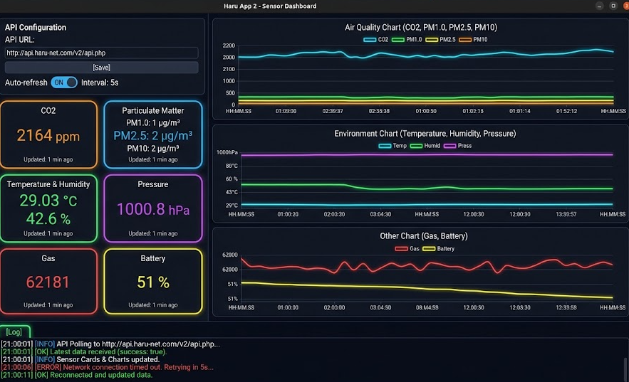

# Haru App 2 - Sensor Dashboard

## Overview

A PyQt6 desktop application that displays real-time sensor data (9 types from ESP32) via cloud API, with AI-powered analysis using Gemini, custom chart generation, and drag-and-drop functionality.

## Features

### Real-Time Sensor Monitoring
- **9 Sensor Types**: co2, pm1.0, pm2.5, pm10, temperature, humidity, pressure, gas, battery
- **6 Grouped Cards**: Air Quality, Particulate Matter, Temperature & Humidity, Pressure, Gas, Battery
- **3 Line Charts**: Air Quality, Environment, Other
- **5-Second Polling**: Auto-refresh data from server
- **Stale Data Warning**: Alerts when data is 3+ minutes old

### Gemini AI Chat
- Ask questions about your sensor data
- Get real-time analysis and insights
- Responses limited to ~100 words for quick reading

### AI Custom Charts
- Create custom charts via natural language (e.g., "Show temperature and CO2 together")
- Drag-and-drop charts from center to AI Custom Charts area
- Normalize option for sensors with different scales (`-n` flag)
- Separate charts option (`-d` flag)
- Toggle visibility with X/O button

### Slash Commands
- `/chart co2 temperature` - Create chart with both sensors
- `/chart gas co2 -n` - Create chart with normalization
- `/chart pm1.0 pm2.5 pm10 -d` - Create separate charts
- Tab completion for sensor names

### Data Analysis
- Click "Analyze Data" to get Gemini insights
- Analysis is automatically sent to server via `api/post-analysis.php`

## How to Use

### 1. Start the Application
```bash
cd haru-app2
python main.py
```

### 2. Configure Server Connection
1. Enter your API URL in the "API URL" field
2. Click "Test" to verify connection
3. Click "Start Polling" to begin receiving data

### 3. View Sensor Data
- **Left Column**: Sensor cards show current values
- **Center Column**: Line charts show historical trends
- **Right Column**: Gemini chat for questions

### 4. Use Gemini Chat
1. Type a question about your sensors
2. Press Enter to send
3. Get AI-powered insights

### 5. Create Custom Charts
**Option A: Natural Language**
- Type: "Show me temperature and humidity together"
- Gemini creates the chart automatically

**Option B: Slash Command**
- `/chart co2 temperature` - Combined chart
- `/chart gas co2 -n` - Normalized (0-1 scale)
- `/chart pm1.0 pm2.5 pm10 -d` - Separate charts

**Option C: Drag and Drop**
- Drag any chart from center to AI Custom Charts area
- Chart is duplicated on the right side

### 6. Analyze Data
1. Click "Analyze Data (Gemini)" button
2. Wait for Gemini response
3. Analysis is sent to server automatically

## Layout

```
+-------------------+-------------------+-------------------+-------------------+
|  Config Panel     |  Sensor Cards     |  Main Charts      |  Gemini Chat      |
|  [API URL]        |  +-------------+  |  Air Quality      |  [Input field]    |
|  [Test] [Poll]    |  | CO2         |  |  +-----------+    |  [Send button]    |
+-------------------+  | 2164 ppm    |  |  | co2, pm   |    |                   |
                       | +-------------+  |  | /\  /\    |    |                   |
                       | | Particulate |  |  +-----------+    |                   |
                       | | PM1.0: 1    |  |                   |                   |
                       | | PM2.5: 2    |  |  Environment      |  AI Custom Charts |
                       | +-------------+  |  +-----------+    |  +-----------+    |
                       | | Temp & Hum  |  |  | temp, hum |    |  | User      |    |
                       | | 29.0 C      |  |  | /\  /\    |    |  | created   |    |
                       | +-------------+  |  +-----------+    |  | charts    |    |
                       | | ...         |  |                   |  +-----------+    |
                       +-------------------+-------------------+-------------------+
|  [Log]  <-- click to expand                                                       |
+-----------------------------------------------------------------------------------+
```

## API Endpoints

| Endpoint | Method | Purpose |
|----------|--------|---------|
| `/api.php` | GET | Fetch sensor data (latest + history) |
| `/api/post-analysis.php` | POST | Send analysis results |

### POST Request Body
```json
{"content": "Analysis text from Gemini..."}
```

## File Structure

| File | Purpose |
|------|---------|
| `main.py` | Entry point |
| `app.py` | Main UI, chat, charts, polling |
| `chart.py` | ChartWidget with drag-and-drop support |
| `worker.py` | Background HTTP requests |
| `gemini_worker.py` | Gemini AI integration |
| `config.py` | Save/load settings |

## Dependencies

```bash
pip install PyQt6 requests matplotlib google-genai
```

## Sensor Data Format

```json
{
  "success": true,
  "server_time": "2026-08-27 12:00:00",
  "latest": {
    "co2": {"data": 2164, "reading_time": "2026-08-27 11:59:00"},
    "temperature": {"data": 29.03, "reading_time": "2026-08-27 11:59:00"}
  },
  "history": {
    "co2": [{"reading_time": "2026-08-27 11:55:00", "data": 2100}, ...],
    "temperature": [{"reading_time": "2026-08-27 11:55:00", "data": 28.5}, ...]
  }
}
```

## Slash Command Options

| Flag | Description |
|------|-------------|
| `-n` | Normalize data to 0-1 range (Min-Max scaling) |
| `-d` | Display each sensor in separate charts |

### Examples
```
/chart co2                    # Single sensor
/chart co2 temperature       # Multiple sensors combined
/chart gas co2 -n            # Normalized for comparison
/chart pm1.0 pm2.5 pm10 -d  # Separate charts
/chart temperature -n -d     # Normalized and separate
```

## Drag and Drop

1. Hover over any chart in the center area
2. Click and drag to AI Custom Charts area (right)
3. Drop to create a copy
4. Use X button to hide, O button to show

## Troubleshooting

### "Disconnected" Status
- Check API URL is correct
- Click "Test" to verify connection
- Ensure server is running

### Charts Not Updating
- Click "Start Polling"
- Check log for errors
- Verify API returns data

### Gemini Not Responding
- Check internet connection
- Verify API key is set (hidden in config)
- Check log for Gemini errors


